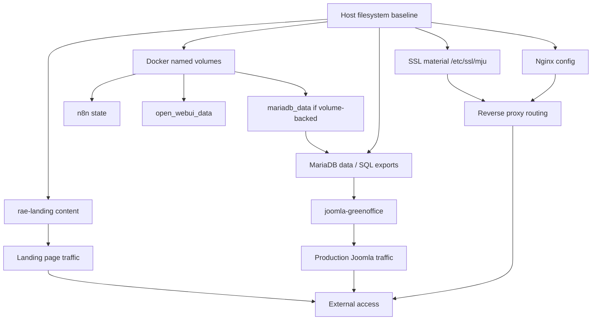

# VPS Restore Simulation Plan
**Date**: 2026-05-23  
**Scope**: Simulation-only cold restore planning for VPS `/home/rae_admin`  
**Status**: Read-only planning artifact, no restore execution

## Purpose
This plan simulates a cold restore sequence for the most restore-critical surfaces on the VPS so the team can assess feasibility, blockers, and manual intervention points before any real recovery window.

## High-Level Verdict
A full cold restore is **not currently high-confidence**. A simulated restore path exists for some services, but there are blockers around Docker named volumes, host SSL material, and `rae-landing` backup certainty.

## Restore Order
The simulated restore order below follows dependency-first recovery.

1. Restore host filesystem baseline and documentation.
2. Restore nginx config and SSL material.
3. Restore MariaDB persistence and database exports.
4. Restore `joomla-greenoffice` content and data.
5. Restore `rae-landing` content.
6. Restore Docker named volumes.
7. Rebuild or reattach services from restored data.
8. Validate application routes and database connectivity.

## Dependency Graph

## Required Artifacts
### Confirmed or partially confirmed artifacts
- `/home/rae_admin/configs/nginx/raeservice.mju.ac.th.conf`
- `/etc/ssl/mju/`
- `/home/rae_admin/docker-raeserver/docker-compose.yml`
- `/home/rae_admin/docker-raeserver/mariadb/data/`
- `/home/rae_admin/joomla-greenoffice/`
- `/home/rae_admin/joomla-greenoffice/backups/`
- `/home/rae_admin/joomla-greenoffice/mariadb_backup/`
- `/home/rae_admin/joomla-greenoffice/mariadb_data/`
- `/home/rae_admin/rae-landing/`
- `/home/rae_admin/landing-page/landing-backups/`
- `/home/rae_admin/.n8n/`
- Docker named volume data for `mariadb_data`, `n8n_data`, `open_webui_data`, `nginx_ssl`

### Missing or unverified artifacts
- A dedicated backup manifest for Docker named volumes
- A verified backup bundle for `rae-landing`
- A confirmed snapshot of `/etc/ssl/mju`
- A tested full-stack database restore set
- A single documented restore checksum map for all runtime paths

## Simulated Restore Sequence
### Stage 1: Foundation
- Restore host filesystem baseline.
- Restore documentation and configuration references.
- Verify target disk space and mount points.

### Stage 2: Nginx and SSL
- Restore `/home/rae_admin/configs/nginx/` contents.
- Restore `/etc/ssl/mju/` material.
- Reconcile nginx config with current host paths.
- Manual intervention point: certificate file names and permissions may need validation.

### Stage 3: Database Layer
- Restore MariaDB data directories or volume-backed database state.
- Reapply SQL backups where data directory restore is incomplete.
- Manual intervention point: confirm database version compatibility and character set integrity.

### Stage 4: Joomla Production Surface
- Restore `joomla-greenoffice` application and content tree.
- Reconcile `joomla_data`, backup folders, and any dynamic content.
- Manual intervention point: decide which backup snapshot is the canonical source of truth.

### Stage 5: Landing Site
- Restore `rae-landing` content.
- Manual intervention point: if no dedicated backup bundle exists, rebuild from source or last known archive only with explicit approval.

### Stage 6: Docker Volumes
- Restore named volumes for `mariadb_data`, `n8n_data`, `open_webui_data`, and `nginx_ssl`.
- Manual intervention point: if volume backups are absent, rebuild may be required and state loss accepted.

### Stage 7: Service Reattachment
- Bring services up in dependency order after storage is confirmed.
- Validate that reverse proxy routing points to live backends.
- Validate that database-backed services can connect before external traffic is allowed.

## Rollback Points
Rollback is only safe at the following boundaries:

1. After host baseline restore, before nginx/SSL activation.
2. After nginx/SSL restore, before database recovery.
3. After database recovery, before service startup.
4. After service startup, before opening external access.

If a failure occurs after one of these points, revert to the immediately previous checkpoint rather than continuing.

## Manual Intervention Points
The restore cannot be fully automated at several steps:

- SSL certificate and key validation under `/etc/ssl/mju`
- MariaDB compatibility checks and data import repair
- Selection of the correct Joomla snapshot
- `rae-landing` recovery if no direct backup exists
- Docker volume recreation if no volume snapshot exists
- Permission and ownership adjustments on restored bind mounts

## Restore Blockers
### Current blockers to confident restore
- No explicit backup manifest for Docker named volumes.
- No proven full restore path for `mariadb_data`.
- No confirmed restore bundle for `rae-landing`.
- No validated snapshot for host SSL material.
- No rehearsal evidence for the end-to-end stack.

### High-risk consequences of these blockers
- Application state loss in `n8n` or `open_webui`.
- Database inconsistency during MariaDB restore.
- SSL or reverse-proxy outage after nginx restore.
- Incomplete landing page recovery.

## What Cannot Currently Be Restored With Confidence
- Docker named volumes as a complete set.
- A full cold restore of the MariaDB-backed services.
- `rae-landing` from a clearly documented backup source.
- SSL and nginx integration as a tested pair.
- The full VPS as one validated recovery unit.

## Services Safe to Rebuild from GitHub
These can be recreated from GitHub or source control with moderate confidence because their primary state is code, not opaque runtime data.

- `real-attendance-system`
- `research-portal-backend`
- `research-portal-frontend`
- `raemju-project`
- `open-design` if needed for tooling or reference

## Services NOT Rebuildable from GitHub Alone
These depend on live data, bind mounts, or runtime state that GitHub does not contain.

- `rae-landing`
- `joomla-greenoffice`
- MariaDB data stores
- `n8n` state
- `open_webui_data`
- SSL material under `/etc/ssl/mju`
- Any service that relies on `/var/www/attendance-dashboard/dist`

## Estimated Downtime
### Simulated downtime bands
- Documentation/config restore only: low, minutes to under an hour.
- Nginx + SSL + DB restore: medium, roughly 1-3 hours.
- Full cold restore including app content and volume recovery: high, roughly 3-8 hours depending on artifact availability and manual repair.

### Main downtime drivers
- Database import or repair time
- Missing volume backups
- Ownership and permission repair on restored bind mounts
- Manual certificate and reverse-proxy validation

## Services and Risk Level
### High-risk services
- `joomla-greenoffice`
- `rae-landing`
- MariaDB-backed stack
- `n8n`
- `open_webui`

### Medium-risk services
- nginx reverse proxy
- `raemju-project`
- `research-portal-*` services

### Lower-risk services
- Documentation tree
- Pure source-code services with no unique runtime state

## Restore Simulation Checklist
- Confirm artifact inventory for each restore layer.
- Confirm a restore order that respects dependencies.
- Identify manual intervention owners for SSL, DB, and bind mounts.
- Record missing artifacts before any real restore window.
- Validate that no service is assumed recoverable from GitHub alone when it depends on runtime data.
- Treat absent volume backups as a hard blocker, not a soft warning.

## Explicit No-Action Warning
This is a planning document only.
- Do not restore.
- Do not deploy.
- Do not restart containers.
- Do not change nginx or docker configuration.
- Do not commit this plan automatically.

## Bottom Line
The simulation shows a plausible restore path, but the current backup story is incomplete. The biggest blockers are Docker volume coverage, SSL artifact certainty, and `rae-landing` backup confidence. Until those are validated, the VPS cannot be treated as fully cold-restore ready.
